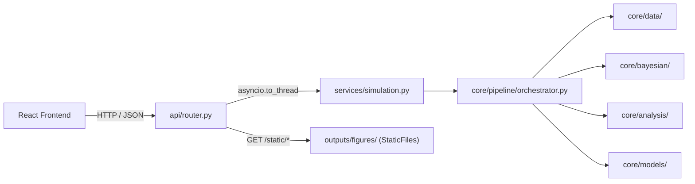

# Backend — FastAPI Service

| Field | Value |
|---|---|
| **Author** | Antoni Dudij, Maksim Feldmann — RWTH Aachen |
| **Status** | Review |
| **Last Updated** | 2026-03-01 |

> **TL;DR** — A FastAPI service that exposes the Bayesian model-selection pipeline over four REST endpoints. Domain logic lives entirely in `core/`, which has no dependency on FastAPI; the service layer is a thin adapter that translates Pydantic schemas into domain calls and offloads the CPU-bound MCMC run to a thread-pool worker via `asyncio.to_thread`.

## Directory Layout

```
apps/backend/
├── api/
│   ├── app.py          Application factory (CORS, static mount, lifespan)
│   └── router.py       Route handlers: health / config / simulate / progress
├── core/               Domain logic — zero dependency on FastAPI
│   ├── analysis/       BeamVisualization, ResultsReporter
│   ├── bayesian/       EulerBernoulliCalibrator, TimoshenkoCalibrator,
│   │                   BridgeSampler, BayesianModelSelector
│   ├── data/           SyntheticDataGenerator (wraps 1D Timoshenko FEM)
│   ├── fem/            TimoshenkoBeamFEM (active); CantileverFEM (archived)
│   ├── models/         EulerBernoulliBeam, TimoshenkoBeam, BaseBeamModel
│   ├── pipeline/       PipelineOrchestrator
│   ├── utils/          load_config, setup_logging
│   └── py.typed        PEP 561 marker
├── schemas/            Pydantic v2 request / response schemas
├── services/           Thin HTTP-to-domain adapter (run_simulation)
└── Dockerfile          Multi-stage Python 3.12 + uv build
```

## Quick Start

```bash
# from project root
make backend-dev          # uvicorn with hot-reload on :8000

# or manually
source .venv/bin/activate
uvicorn apps.backend.api.app:app --reload --port 8000
```

## API Endpoints

| Method | Path | Description |
|---|---|---|
| `GET` | `/api/health` | Liveness probe — returns `{"status":"ok"}` |
| `GET` | `/api/config` | Return the active `SimulationConfigIn` document |
| `POST` | `/api/config` | Replace the active configuration |
| `POST` | `/api/simulate` | Run the full pipeline; holds connection until complete |
| `GET` | `/api/progress` | Poll live stage/step/message during a running simulation |

Interactive Swagger UI: **http://localhost:8000/docs** — ReDoc: **http://localhost:8000/redoc**

`POST /api/simulate` is CPU-bound (MCMC takes O(minutes)) and blocks the HTTP connection for the pipeline duration. The frontend polls `/api/progress` on a fixed interval to render a live progress indicator without requiring WebSocket infrastructure.

## Request / Response Schemas

All schemas are defined as Pydantic v2 models in `apps/backend/schemas/simulation.py`.

### `SimulationConfigIn`

```json
{
  "beam_parameters": { "length": 1.0, "width": 0.1, "aspect_ratios": [5, 10, 20] },
  "material":        { "elastic_modulus": 2.1e11, "poisson_ratio": 0.3 },
  "bayesian":        { "n_samples": 800, "n_tune": 400, "n_chains": 2 },
  "data":            { "noise_fraction": 0.0005 }
}
```

### `SimulationResultOut`

```json
{
  "jobId": "a1b2c3d4e5f6",
  "status": "completed",
  "logBayesFactors": { "5": -10.83, "10": -4.15, "20": 0.42 },
  "recommendedModel": "Euler-Bernoulli",
  "transitionPoint": 19.2,
  "plots": ["/static/figures/bayes_factor.png"]
}
```

Response keys are **camelCase** (`serialization_alias` on each Pydantic field) to match TypeScript consumer conventions. The full schema reference is in [docs/api-reference.md](../../docs/api-reference.md#7-rest-api-contract).

## Architecture



The service layer (`services/simulation.py`) is intentionally thin. It converts the Pydantic `SimulationConfigIn` into the dict format `PipelineOrchestrator` expects, invokes the pipeline, and maps the results dict back to `SimulationResultOut`. No business logic lives in the service layer.

## Docker

```bash
# backend only
docker build -t dt-backend -f apps/backend/Dockerfile .
docker run -p 8000:8000 dt-backend

# full stack via Docker Compose (backend + frontend)
make up
```

The Dockerfile uses a multi-stage build: a `builder` stage installs dependencies with `uv` into a virtualenv, and the final `runtime` stage copies only the virtualenv and application code, keeping the image lean.
