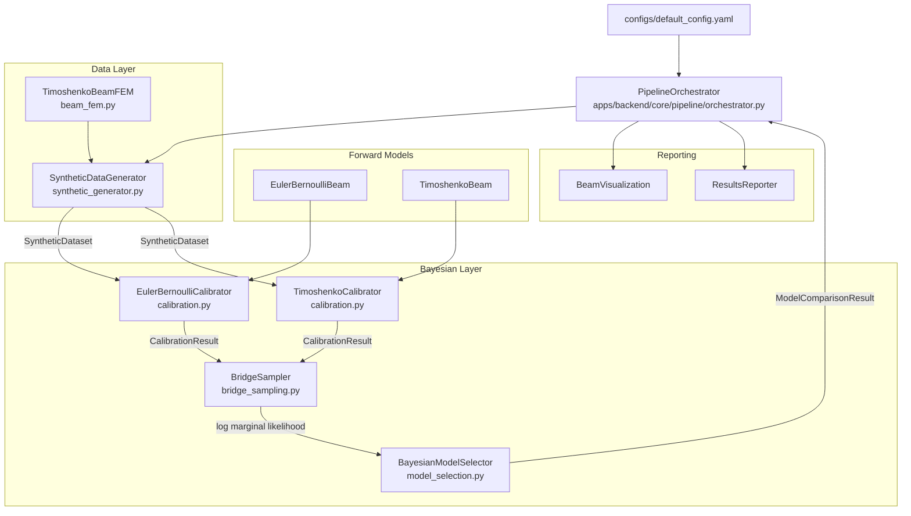
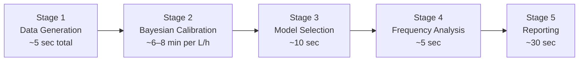
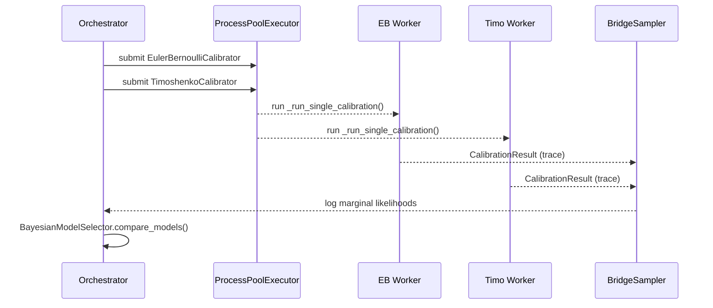
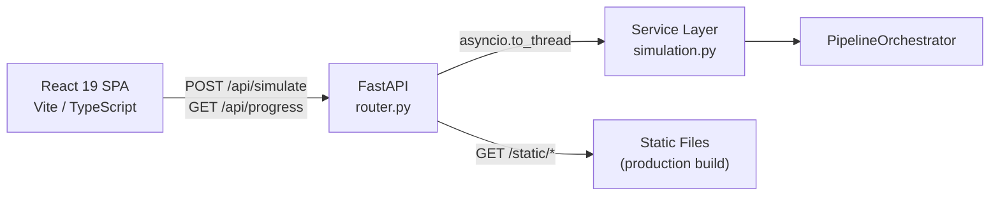

# Architecture

| Field        | Value                                       |
|--------------|---------------------------------------------|
| **Author**   | Antoni Dudij, Maksim Feldmann — RWTH Aachen |
| **Status**   | Review                                      |
| **Last Updated** | 2026-03-01                              |

---

## TL;DR

The system decomposes into six domain layers (FEM, beam models, data generation, Bayesian inference, analysis, orchestration) that are fully decoupled from the HTTP/UI layer and wired together by `PipelineOrchestrator`. Every layer is independently testable and replaceable; the only shared contract is the `SyntheticDataset` and `CalibrationResult` dataclasses that flow between stages.

---

## Design Principles

Three constraints drove every significant design decision.

**Separation of concerns.** The domain logic in `apps/backend/core/` has no import dependency on FastAPI, React, or any other delivery mechanism. The service layer in `apps/backend/services/simulation.py` is the only place where HTTP schemas are translated into core domain calls. This means the full pipeline can be invoked from the CLI, a test harness, or a Jupyter notebook without any server running.

**Reproducibility.** All randomness is seeded through `NoiseModel.seed` and `BridgeSampler.seed`. Configuration is entirely YAML-driven; no parameter is hardcoded in business logic. Re-running the pipeline with the same `configs/default_config.yaml` produces bit-identical HDF5 datasets and numerically stable (though not bit-identical across PyMC versions) posteriors.

**Extensibility.** Adding a third beam theory (e.g., Reddy third-order shear deformation) requires implementing one `BaseBeamModel` subclass, one `BayesianCalibrator` subclass, and one line in the orchestrator. No other module needs to change.

---

## High-Level Component Map

---

## Core Components

### 1. Data Generation (`apps/backend/core/data/`)

`SyntheticDataGenerator` builds measurement datasets by running the 1D Timoshenko FEM at each requested aspect ratio, sampling the solution at sensor locations, and injecting Gaussian noise proportional to the signal amplitude via `noise_fraction`. Datasets are immediately serialised to HDF5 (`outputs/data/dataset_Lh_{ratio}.h5`) so that calibration can be re-run without touching the FEM stage.

The deliberate choice of 1D Timoshenko FEM as the ground-truth simulator (rather than the 2D plane-stress FEM that was used in the project's first iteration) is documented in the [Design Decisions](#design-decisions) section below.

### 2. FEM Layer (`apps/backend/core/fem/`)

`TimoshenkoBeamFEM` assembles a global stiffness matrix from 2-node Timoshenko beam elements, each with two DOFs per node (transverse deflection $w$ and rotation $\theta$). The mesh is adaptive: $n_{elements} = \min(4 \cdot L/h,\ 200)$. Boundary conditions for a cantilever are enforced by eliminating the clamped-end DOFs before solving $\mathbf{K}\mathbf{u} = \mathbf{f}$. The solver is wrapped by `BeamFEMResult`, which exposes `tip_deflection` and `get_deflection_at(x_points)` for arbitrary interpolation.

The legacy `cantilever_fem.py` (2D plane-stress, ~20 000 elements) remains in the repository as a reference but is not executed during any pipeline stage.

### 3. Beam Theory Forward Models (`apps/backend/core/models/`)

`EulerBernoulliBeam` and `TimoshenkoBeam` both derive from `BaseBeamModel` and implement a shared interface of four abstract methods: `compute_deflection`, `compute_rotation`, `compute_strain`, and `compute_natural_frequencies`. Two concrete methods — `compute_moment` and `compute_shear` — are provided by the base class and require no override.

These models serve a dual role: they generate reference solutions in the data-generation stage and act as the forward models inside the PyMC probabilistic graph during MCMC. Because PyMC requires PyTensor-compatible arithmetic, each calibrator implements a separate `_pytensor_forward_normalized()` method that mirrors the analytical equations using symbolic tensor operations.

### 4. Bayesian Inference (`apps/backend/core/bayesian/`)

This layer is the computational core of the system and is further decomposed into four modules.

**`calibration.py`** defines both calibrator classes. Each builds a PyMC model in normalised coordinates — Young's modulus $E$ and observation noise $\sigma$ for EB; additionally Poisson's ratio $\nu$ for Timoshenko — runs NUTS sampling, and stores the resulting `az.InferenceData` trace. Convergence is validated via $\hat{R}$ and effective sample size immediately after sampling. The module-level function `_run_single_calibration` is intentionally placed at module scope so it is picklable by `ProcessPoolExecutor`.

**`bridge_sampling.py`** implements the Meng & Wong (1996) iterative bridge estimator to compute $\ln p(\mathbf{y} \mid M)$ from the MCMC trace. The proposal distribution is a multivariate normal fitted to the posterior by moment matching. Iteration continues until the relative change in the estimate drops below $10^{-6}$ or 1 000 iterations are exhausted.

**`model_selection.py`** houses `BayesianModelSelector`, which computes the log Bayes factor from the two `marginal_likelihood_estimate` fields and classifies it on the Kass–Raftery (1995) scale. The class also exposes `analyze_aspect_ratio_study()` for computing transition points across a full aspect-ratio sweep.

**`normalization.py`** provides `compute_normalization_params()` and the `NormalizationParams` dataclass. All MCMC sampling occurs in a normalised space where $E_{norm} = E / (210 \times 10^9)$ and $w_{norm} = w / \max|w_{obs}|$; results are denormalised before being written into `CalibrationResult.posterior_summary`.

### 5. Analysis and Visualization (`apps/backend/core/analysis/`)

`BeamVisualization` encapsulates all plotting logic and writes figures to `outputs/figures/`. `ResultsReporter` generates three output formats: a human-readable text summary, a machine-readable JSON file, and a CSV for downstream statistical analysis. Neither class has any dependency on the Bayesian or FEM layers; they operate solely on `CalibrationResult` and `ModelComparisonResult` dataclasses.

### 6. Pipeline Orchestration (`apps/backend/core/pipeline/`)

`PipelineOrchestrator` coordinates the five stages described in [Pipeline Execution Flow](#pipeline-execution-flow). Aspect ratios are processed sequentially to bound peak memory usage at roughly 1 GB per in-flight calibration pair. Within each aspect ratio, the EB and Timoshenko calibrations are submitted in parallel to a `ProcessPoolExecutor`, reducing wall-clock time for the calibration stage by approximately 40%.

---

## Pipeline Execution Flow

Within Stage 2, for each aspect ratio the EB and Timoshenko calibrations execute concurrently:

---

## Web Dashboard Architecture

The project ships with an interactive dashboard built on FastAPI (backend) and React 19 (frontend).

In development, Vite proxies all `/api/*` requests to the backend at `http://localhost:8000`. In production, the frontend is compiled to static assets and served directly by FastAPI's `StaticFiles` mount; no separate web server is required.

The frontend follows an MVVM pattern: `views/Dashboard.tsx` owns rendering, `viewmodels/useSimulationViewModel.ts` is a React hook that manages all API calls and state, and `models/types.ts` declares the TypeScript interfaces that mirror the Pydantic backend schemas.

---

## Design Decisions

### 1. 1D FEM instead of 2D plane-stress FEM

The original implementation used a 2D plane-stress mesh (~20 000 elements). That approach introduced a systematic ~1% stiffness over-estimate at the clamped boundary due to shear-locking and Saint-Venant constraint effects. For intermediate aspect ratios ($L/h \approx 10$–$20$), a 1% stiffness error is sufficient to shift the log Bayes factor by ~0.5, which is exactly the inconclusive threshold. Switching to 1D Timoshenko FEM eliminates the error entirely (0.0000% deviation from analytical solution), removes the boundary artefact, and reduces computation time by a factor of 100.

### 2. Bridge sampling instead of WAIC for evidence

WAIC estimates leave-one-out predictive accuracy, not marginal likelihood. For model comparison, Bayes factors require the marginal likelihood $p(\mathbf{y} \mid M) = \int p(\mathbf{y} \mid \boldsymbol{\theta}, M)\, p(\boldsymbol{\theta} \mid M)\, d\boldsymbol{\theta}$. WAIC does not approximate this integral and in general does not produce consistent Bayes factors. Bridge sampling is more expensive but provides the correct quantity. WAIC is retained as a convergence diagnostic.

### 3. ProcessPoolExecutor for calibration parallelism

PyMC maintains process-global PyTensor graph state. Running two calibrators concurrently in the same process corrupts the graph. Separate subprocesses each get an isolated Python interpreter, resolving the conflict at the cost of inter-process serialisation. Because the data that crosses the process boundary is only a `SyntheticDataset` (~100 KB) and the returned `CalibrationResult` (~50 MB trace), the serialisation overhead is negligible relative to MCMC wall time.

### 4. Sequential aspect ratio processing

Running all aspect ratios in parallel would require holding $2N$ PyMC traces in memory simultaneously, where $N$ is the number of ratios. At ~100 MB per trace, ten aspect ratios would require ~2 GB of active memory plus GC overhead. Sequential processing caps peak usage at ~1 GB with negligible total runtime increase because the dominant cost (MCMC sampling) is already parallelised per-ratio.

---

## Performance Reference

| Stage | Wall Time |
|---|---|
| Data generation (10 aspect ratios) | ~5 seconds |
| Calibration per aspect ratio (EB + Timo in parallel) | ~6–8 minutes |
| Model selection | ~10 seconds |
| Frequency analysis | ~5 seconds |
| Reporting | ~30 seconds |
| **Full pipeline (10 aspect ratios)** | **~30–40 minutes** |

Peak memory during calibration: ~1 GB.

---

## Dependencies

| Category | Packages |
|---|---|
| Probabilistic inference | PyMC ≥ 5.10, ArviZ ≥ 0.17 |
| Numerics | NumPy ≥ 1.24, SciPy ≥ 1.11 |
| Visualisation | Matplotlib ≥ 3.7, Seaborn ≥ 0.12 |
| Backend | FastAPI ≥ 0.110, Uvicorn ≥ 0.27, Pydantic ≥ 2.5 |
| Frontend | React 19, TypeScript 5.9, Vite 8, Bun |
| Utilities | PyYAML ≥ 6.0, Rich ≥ 13.0, Click ≥ 8.1 |

---

## Extending the System

**Adding a new beam theory** requires four steps: create a subclass of `BaseBeamModel` in `apps/backend/core/models/`, implement the four abstract methods, create a corresponding `BayesianCalibrator` subclass in `calibration.py`, and register it in `PipelineOrchestrator._setup_components()`. No other module requires modification.

**Adding a new FEM solver** requires implementing the solver class in `apps/backend/core/fem/` and updating `SyntheticDataGenerator` to call it. The rest of the pipeline is agnostic to how `SyntheticDataset` was produced.

---

## References

1. Gelman, A., et al. *Bayesian Data Analysis*, 3rd ed.
2. Hughes, T. J. R. *The Finite Element Method*. Prentice-Hall, 1987.
3. Meng, X.-L., & Wong, W. H. (1996). Simulating ratios of normalizing constants via a simple identity. *Statistica Sinica*, 6(4), 831–860.
4. Kass, R. E., & Raftery, A. E. (1995). Bayes Factors. *Journal of the American Statistical Association*, 90(430), 773–795.
