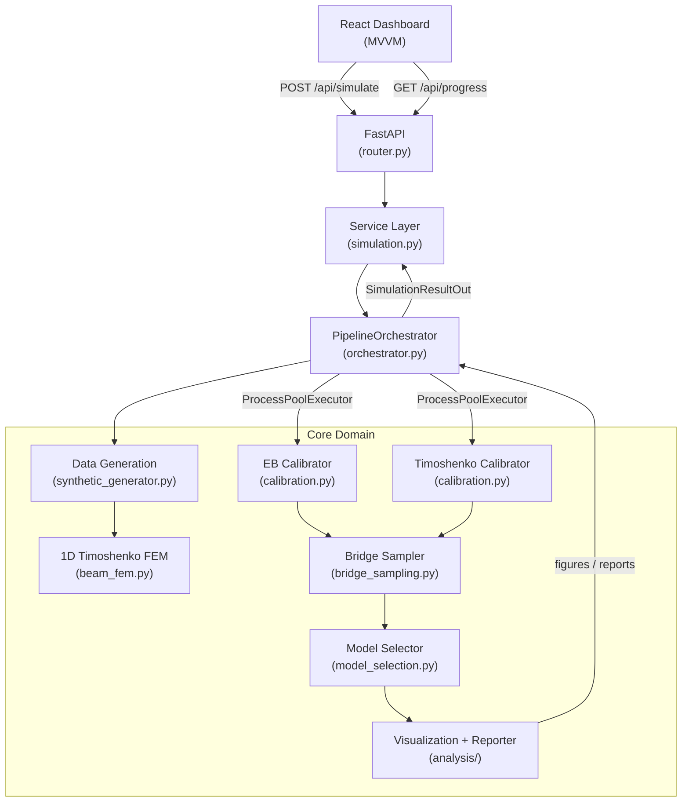
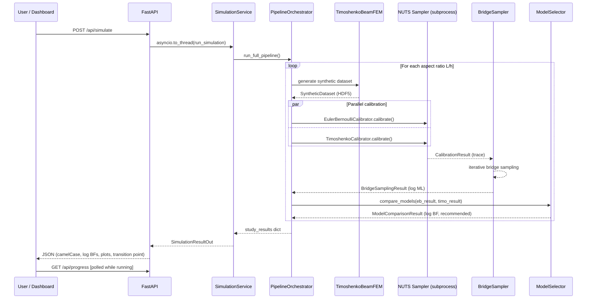

# Technical Specification: Bayesian Beam Theory Model Selection for Digital Twins

| Field        | Value                                      |
|--------------|--------------------------------------------|
| **Author**   | Antoni Dudij, Maksim Feldmann — RWTH Aachen |
| **Status**   | Review                                     |
| **Last Updated** | 2026-03-01                             |

---

## TL;DR

This system automates the selection of the correct beam theory — Euler-Bernoulli (EB) or Timoshenko — for a structural digital twin by performing Bayesian calibration on synthetic FEM data and comparing models via the log Bayes factor. A FastAPI backend and React frontend expose the full pipeline as an interactive web application. Empirical results identify a geometry-driven transition at aspect ratio $L/h \approx 19.2$, below which Timoshenko is decisively preferred and above which EB is sufficient.

---

## Context and Problem

Structural Health Monitoring (SHM) digital twins rely on an embedded physics model to translate sensor measurements into predictions of deflection, stress, and remaining life. In beam-like structures, practice converges on either the Euler-Bernoulli (EB) or Timoshenko theory, and the choice propagates through every downstream inference step.

The conventional approach is to select a theory by engineering rule of thumb: EB for "slender" beams ($L/h > 20$), Timoshenko otherwise. This heuristic has three failure modes common enough to matter in real deployments.

1. **No formal uncertainty quantification.** The rule provides no probability that the chosen theory is correct given the observed data.
2. **Threshold ambiguity.** When $L/h$ falls in the range 15–25, the rule is silent and engineers disagree.
3. **No portability.** A digital twin for one beam cannot justify its model choice to an auditor or certification body without a reproducible statistical argument.

The core question this project formalises is: *can sensor data alone determine which beam theory a digital twin should use?*

---

## Proposed Solution

The system frames model selection as Bayesian hypothesis testing. For each aspect ratio under study, two competing probabilistic models — one based on EB governing equations, one on Timoshenko — are calibrated against the same synthetic FEM dataset via MCMC. Their marginal likelihoods $p(\mathbf{y} \mid M_k)$ are estimated using bridge sampling. The log Bayes factor

$$\ln B_{12} = \ln p(\mathbf{y} \mid M_1) - \ln p(\mathbf{y} \mid M_2)$$

is the decision statistic. A positive value favours $M_1$ (EB), a negative value favours $M_2$ (Timoshenko), and values in $(-0.5, 0.5)$ are treated as inconclusive under the Kass–Raftery scale.

The full system is packaged as a full-stack web application. A React 19 + TypeScript dashboard lets users configure beam geometry, material properties, and sampling hyperparameters; a FastAPI server executes the pipeline without blocking the event loop; and all artefacts (HDF5 datasets, calibration traces, plots, reports) are written to a versioned `outputs/` directory.

**High-Level Architecture Diagram**

---

## Detailed Design

### 1. Data Generation

The module `apps/backend/core/data/synthetic_generator.py` uses a high-fidelity 1D Timoshenko FEM (`beam_fem.py`) as the ground-truth simulator. For each aspect ratio $L/h$, a cantilever beam under a 1 kN tip point load is discretised into $n = \min(4 \cdot L/h,\ 200)$ elements. Displacement and strain sensor readings are sampled at configurable locations and corrupted by Gaussian noise proportional to the signal amplitude via a `noise_fraction` parameter (default $5 \times 10^{-4}$).

The resulting `SyntheticDataset` is serialised to HDF5 (`outputs/data/dataset_Lh_{ratio}.h5`) to allow independent re-runs of the calibration stage without regenerating data.

**Why 1D FEM rather than 2D plane-stress FEM?** A 2D plane-stress model introduces artificial boundary stiffness at the fixed end that does not appear in closed-form Timoshenko theory, producing a systematic disagreement that contaminates model comparison. The 1D Timoshenko FEM, by construction, is exactly consistent with the Timoshenko analytical solution, making it a clean "ground truth" against which to test both theories.

### 2. Beam Theory Forward Models

Both `EulerBernoulliBeam` and `TimoshenkoBeam` derive from `BaseBeamModel` and implement a shared interface: `compute_deflection(x, load)`, `compute_rotation(x, load)`, `compute_strain(x, y, load)`, and `compute_natural_frequencies(n_modes)`.

The critical difference is the deflection equation for a cantilever under tip load $P$:

**Euler-Bernoulli:**
$$\delta_{EB}(L) = \frac{PL^3}{3EI}$$

**Timoshenko (adds shear term):**
$$\delta_{T}(L) = \frac{PL^3}{3EI} + \frac{PL}{\kappa GA}$$

where $\kappa$ is the shear correction factor (5/6 for rectangular cross-sections), $G = E / (2(1+\nu))$, and $A = b \cdot h$. For large $L/h$ the shear term becomes negligible, which is why EB is accurate for slender geometries but not for thick ones.

### 3. Bayesian Calibration

`EulerBernoulliCalibrator` and `TimoshenkoCalibrator` each construct a PyMC probabilistic model that places priors over the elastic modulus $E$ and Poisson ratio $\nu$, computes the analytical deflection and strain predictions, and then conditions on the observed sensor data through a Gaussian likelihood:

$$\mathbf{y} \mid \boldsymbol{\theta}, M_k \sim \mathcal{N}\!\left(\hat{\mathbf{y}}(\boldsymbol{\theta}, M_k),\ \sigma^2 \mathbf{I}\right)$$

MCMC sampling is run via PyMC's NUTS sampler with default settings of 800 draws, 400 tuning steps, and 2 chains. All physical quantities are normalised to unit scale before entering the PyMC graph to improve sampler geometry; the `NormalizationParams` object records the scale factors so posterior summaries are always returned in physical units.

Convergence is validated automatically: if any parameter's $\hat{R} > 1.05$, a `ConvergenceWarning` is raised; if $\hat{R} > 1.1$, the run raises a `ConvergenceError` and the result is not used for model comparison.

#### Parallelisation Strategy

Each aspect ratio requires two independent calibration runs (EB + Timoshenko). Because PyMC/PyTensor maintains process-global graph state, the orchestrator launches these as separate subprocesses via `ProcessPoolExecutor`, with the module-level picklable function `_run_single_calibration` as the worker entry point. This eliminates GIL contention and graph-state collisions at the cost of inter-process serialisation overhead (the dominant cost is MCMC time, so the trade-off is favourable).

### 4. Bridge Sampling for Marginal Likelihood Estimation

The `BridgeSampler` class in `bridge_sampling.py` implements the iterative bridge sampling identity (Meng & Wong, 1996):

$$\ln p(\mathbf{y} \mid M) = \ln \frac{\mathbb{E}_{q}[\, p(\mathbf{y}\mid\boldsymbol{\theta})\, p(\boldsymbol{\theta}\mid M) / q(\boldsymbol{\theta})\,]}{\mathbb{E}_{\pi}[\, 1 / q(\boldsymbol{\theta})\,]}$$

where $q(\boldsymbol{\theta})$ is a proposal distribution fitted to the posterior via moment matching. The iteration converges when the relative change in the log marginal likelihood estimate falls below $10^{-6}$ or after 1 000 iterations. The method is preferred over WAIC/LOO because it targets the true model evidence $p(\mathbf{y} \mid M)$ rather than a predictive-accuracy proxy.

### 5. Model Selection Decision Logic

`BayesianModelSelector.compare_models()` receives the two `CalibrationResult` objects, retrieves their `marginal_likelihood_estimate` fields, and computes the log Bayes factor. Evidence interpretation follows the Kass–Raftery (1995) scale:

| $|\ln B_{12}|$ | Interpretation | Numeric $B_{12}$ |
|---|---|---|
| $< 1.1$ | Weak / inconclusive | $< 3$ |
| $1.1$ – $2.3$ | Positive | $3$ – $10$ |
| $2.3$ – $4.6$ | Strong | $10$ – $100$ |
| $> 4.6$ | Very strong | $> 100$ |

When $|\ln B_{12}| < 0.5$ the decision is explicitly labelled *inconclusive* and the simpler model (EB) is returned as the default recommendation. This is a deliberate engineering conservatism: EB makes fewer assumptions and yields a less expensive computation in the downstream digital twin.

### 6. Full Pipeline Sequence

### 7. REST API Contract

The backend exposes four endpoints under the `/api` prefix. All request and response schemas are defined as Pydantic v2 models in `apps/backend/schemas/`.

| Method | Path | Description |
|--------|------|-------------|
| `GET`  | `/api/health` | Liveness probe; returns `{"status": "ok"}`. |
| `GET`  | `/api/config`  | Returns the active `SimulationConfigIn` document. |
| `POST` | `/api/config`  | Replaces the active configuration. |
| `POST` | `/api/simulate` | Launches the pipeline; returns `SimulationResultOut` when complete. |
| `GET`  | `/api/progress` | Polls the in-memory progress dict written by the service layer. |

`POST /api/simulate` is intentionally synchronous from the caller's perspective: the server blocks the HTTP connection until the pipeline completes (O(minutes) for full aspect-ratio sweeps). The frontend polls `/api/progress` on a fixed interval to render a live progress indicator without requiring WebSocket infrastructure.

#### Key Schema Fields

`SimulationResultOut` returns the following fields (camelCase for JS consumers):

- `jobId` — UUID for the completed run.
- `status` — one of `pending | running | completed | failed`.
- `logBayesFactors` — map from aspect ratio string to $\ln B_{EB/Timo}$.
- `recommendedModel` — the majority recommendation across all ratios.
- `transitionPoint` — aspect ratio at which $\ln B$ crosses zero (linear interpolation).
- `plots` — list of base64-encoded PNG plot paths.

### 8. Configuration Reference

All tunable parameters live in `configs/default_config.yaml`. Key fields:

| Key | Default | Effect |
|-----|---------|--------|
| `beam_parameters.aspect_ratios` | `[5, 8, 10, 12, 15, 20, 30, 50]` | Aspect ratios to sweep; each adds one data-gen + two calibration jobs. |
| `material.elastic_modulus` | `2.1e11` Pa | Steel Young's modulus. |
| `bayesian.n_samples` | `800` | NUTS draw count per chain. Increase to `2000` for publication-quality posteriors. |
| `bayesian.n_tune` | `400` | NUTS warm-up steps. |
| `bayesian.n_chains` | `2` | Chain count. Mirror of `ProcessPoolExecutor` worker count. |
| `data.noise_fraction` | `5e-4` | Gaussian noise as a fraction of signal amplitude. |

### 9. Empirical Results

Running the default configuration over a steel cantilever ($L = 1.0$ m, $b = 0.1$ m, $E = 210$ GPa, $\nu = 0.3$) under a 1 kN tip load produces the following model comparison:

| $L/h$ | $\ln B_{EB/Timo}$ | Recommended |
|-------|-------------------|-------------|
| 5     | −10.830           | Timoshenko  |
| 8     | −7.377            | Timoshenko  |
| 10    | −4.146            | Timoshenko  |
| 12    | −3.595            | Timoshenko  |
| 15    | −2.109            | Timoshenko  |
| 20    | +0.420            | EB          |
| 30    | +0.255            | EB          |
| 50    | −0.031            | inconclusive|

Linear interpolation of $\ln B_{EB/Timo} = 0$ across the $L/h \in [15, 20]$ interval places the **transition point at $L/h \approx 19.2$**. The behaviour at $L/h = 50$ illustrates the inconclusive zone: both theories predict almost identical deflections at extreme slenderness, and the evidence cannot distinguish them.

### 10. Known Trade-offs and Limitations

**Bridge sampling variance.** Bridge sampling is the most accurate practical estimator for $p(\mathbf{y} \mid M)$, but its standard error grows with posterior dimension. For models with more than ~10 parameters, the proposal-distribution fit can degrade and the standard error should be inspected before accepting the log Bayes factor.

**Synthetic data self-consistency.** Since the data are generated by a 1D Timoshenko FEM that is mathematically identical to the Timoshenko forward model used in calibration, the Timoshenko evidence will be artificially inflated for thick beams. In a real deployment, the ground-truth FEM would be replaced by physical sensor records, which would attenuate this advantage but would also introduce model-form uncertainty absent here.

**Blocking HTTP endpoint.** `POST /api/simulate` holds the HTTP connection for the full pipeline duration. This is acceptable for a single-user lab application but would require a task-queue architecture (e.g., Celery + Redis) for multi-tenant production use.

---

## References

1. Kass, R. E., & Raftery, A. E. (1995). Bayes Factors. *Journal of the American Statistical Association*, 90(430), 773–795.
2. Meng, X.-L., & Wong, W. H. (1996). Simulating Ratios of Normalizing Constants via a Simple Identity. *Statistica Sinica*, 6(4), 831–860.
3. Gronau, Q. F., et al. (2017). A tutorial on bridge sampling. *Journal of Mathematical Psychology*, 81, 80–97.
4. Vehtari, A., Gelman, A., & Gabry, J. (2017). Practical Bayesian model evaluation using leave-one-out cross-validation and WAIC. *Statistics and Computing*, 27(5), 1413–1432.
5. Timoshenko, S. P. (1921). On the correction factor for shear of the differential equation for transverse vibrations of bars. *Philosophical Magazine*, 41, 744–746.
